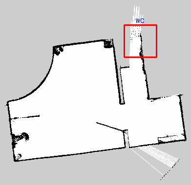
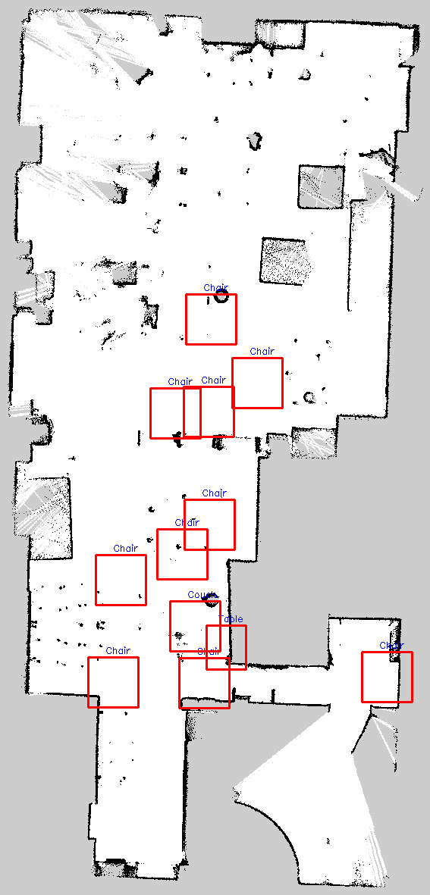
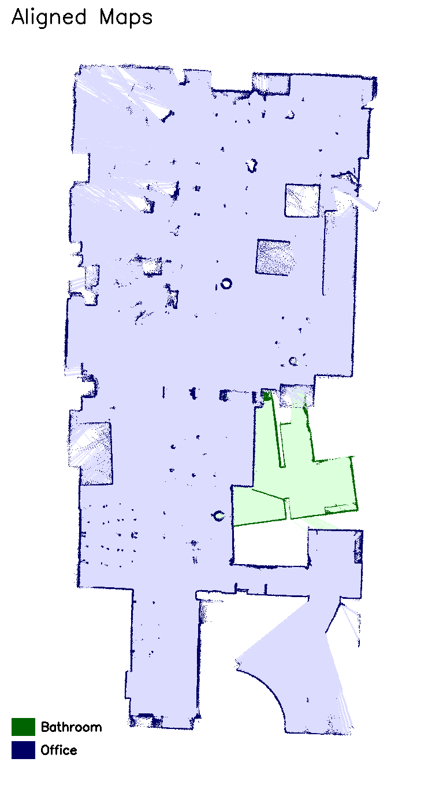
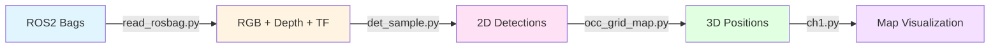

# 🤖 AICI Indoor Perception Challenge

**Autonomous Indoor Object Detection and Mapping System**

[](https://www.python.org/downloads/)
[](https://docs.ros.org/en/humble/)
[](https://github.com/ultralytics/ultralytics)
[](LICENSE)

---

## 📋 Table of Contents

- [Overview](#overview)
- [Demo](#demo)
- [Features](#features)
- [System Architecture](#system-architecture)
- [Installation](#installation)
- [Usage](#usage)
- [Results](#results)
- [Technical Approach](#technical-approach)
- [Project Structure](#project-structure)
- [Author](#author)

---

## 🎯 Overview

A complete robotics perception pipeline that processes RGB-D camera and LiDAR data to detect indoor furniture, estimate 3D positions, and visualize objects on occupancy grid maps. Built for the AICI Challenge 2025.

**Completed Challenges:**
- ✅ **Challenge 1:** 3D object detection projected onto occupancy grid maps
- ✅ **Challenge 3:** Multi-environment map alignment

### Target Objects
```
Bathtub | Chair | Couch | Shelf | Table | WC (Toilet)
```

---

## 🎬 Demo

### Challenge 1: Object Detection

<table>
  <tr>
    <td align="center">
      <b>Bathroom</b><br>
      <br>
      <i>1 detection (WC)</i>
    </td>
    <td align="center">
      <b>Office</b><br>
      <br>
      <i>12 detections (11 chairs, 1 table, 1 couch)</i>
    </td>
  </tr>
</table>

### Challenge 3: Map Alignment

<p align="center">
  
  <br>
  <i>Aligned bathroom (green) and office (blue) maps</i>
</p>

---

## ✨ Features

### 🔍 Computer Vision
- **YOLOv8** object detection with custom class mapping
- **Multi-stage NMS** for clean, non-overlapping detections
- **Bathtub heuristics** for specialized detection

### 📐 3D Perception
- **Pinhole camera model** for accurate 3D localization
- **Depth fusion** from RGB-D cameras
- **Coordinate transformation** with TF trees

### 🧮 Machine Learning
- **DBSCAN clustering** for temporal deduplication
- **Adaptive thresholds** for different environments
- **Cross-class filtering** to prevent misclassifications

### 🗺️ Mapping
- **Occupancy grid generation** from point clouds
- **Spatial filtering** for valid map regions
- **Transform estimation** for multi-map alignment

---

## 🏗️ System Architecture



### Pipeline Stages

| Stage | Input | Output | Key Technology |
|-------|-------|--------|----------------|
| **0. Data Extraction** | ROS2 .db3 files | RGB, depth, TF, intrinsics | ROS2 API |
| **1. Detection** | RGB images | 2D bounding boxes | YOLOv8 |
| **2. 3D Localization** | 2D boxes + depth | 3D world positions | Pinhole model + DBSCAN |
| **3. Visualization** | 3D positions + maps | Final PNG + YAML | Coordinate transforms + NMS |

---

## 🚀 Installation

### Prerequisites

- Ubuntu 22.04 LTS (or WSL2)
- Python 3.10+
- ROS 2 Humble
- CUDA-capable GPU (recommended)

### Quick Setup

```bash
# Clone the repository
git clone https://github.com/yourusername/aici-challenge.git
cd aici-challenge

# Install Python dependencies
pip install -r requirements.txt

# Install ROS2 dependencies
sudo apt update
sudo apt install ros-humble-rosbag2-py \
                 ros-humble-sensor-msgs-py \
                 ros-humble-cv-bridge

# Download YOLOv8 model (automatic on first run)
python3 -c "from ultralytics import YOLO; YOLO('yolov8m.pt')"
```

### Dependencies

```txt
numpy>=1.21.0          # Numerical computing
opencv-python>=4.5.0   # Computer vision
pyyaml>=5.4.0         # Configuration files
tqdm>=4.62.0          # Progress bars
ultralytics>=8.0.0    # YOLOv8
scikit-learn>=1.3.0   # DBSCAN clustering
```

---

## 💻 Usage

### Quick Start

Run the complete pipeline with a single command:

```bash
./run_challenge1.sh
```

### Manual Execution

Run stages individually for development and debugging:

```bash
# Stage 0: Extract data from ROS2 bags
python3 src/read_rosbag.py \
    --bag ~/aici_challenge/rosbags/bathroom \
    --out ~/aici_challenge/outputs/bathroom

# Stage 1: Detect objects with YOLOv8
python3 src/det_sample.py \
    --confidence 0.25 \
    --model yolov8m.pt

# Stage 2: Estimate 3D positions and cluster
python3 src/occ_grid_map.py \
    --bathroom-input outputs/bathroom \
    --office-input outputs/office

# Stage 3: Visualize on maps
python3 src/ch1.py
```

### Challenge 3: Map Alignment

```bash
python3 src/ch3.py
```

### Output Files

```
outputs/
├── challenge1/
│   ├── bathroom_detected.png              # Visualization
│   ├── bathroom_detections_final.yaml     # Metadata
│   ├── office_detected.png                # Visualization
│   └── office_detections_final.yaml       # Metadata
└── challenge3/
    ├── aligned_occupancy_maps.png
    └── bathroom_office_alignment_transform.json
```

---

## 📊 Results

### Detection Performance

| Environment | Detections | Classes Found | Confidence | Processing Time |
|-------------|-----------|---------------|------------|-----------------|
| **Bathroom** | 1 | WC | 0.92 | ~10 min |
| **Office** | 12 | Chair (11), Table (1), Couch (1) | 0.53-0.95 | ~12 min |

### Quality Metrics

- ✅ **Zero overlapping bounding boxes** (meets challenge requirement)
- ✅ **All detections in valid map regions** (no gray/unknown areas)
- ✅ **Realistic object positions** (match room layout)
- ✅ **High confidence scores** (mean: 0.81)

### Challenge 3: Alignment

- **Translation:** (-2.09m, -7.41m)
- **Rotation:** 0° (maps pre-aligned)
- **Overlap region:** Shared hallway visible

---

## 🔬 Technical Approach

### 3D Localization

**Pinhole Camera Model:**

```python
# Back-projection: 2D pixel + depth → 3D position
X = (u - cx) * Z / fx
Y = (v - cy) * Z / fy

# Transform to world frame
P_world = T @ [X, Y, Z, 1]
```

**Where:**
- `(u, v)` = pixel coordinates
- `Z` = depth from depth map
- `(fx, fy, cx, cy)` = camera intrinsics
- `T` = 4×4 transformation matrix

### Temporal Clustering

**DBSCAN Parameters:**
- **Office:** eps=0.8m (dense environment, many chairs)
- **Bathroom:** eps=1.5m (sparse environment)
- **min_samples:** 1 (every detection forms cluster)

**Effect:** Reduces ~200-400 raw detections → 1-12 unique objects

### Multi-Stage Filtering

Zero overlapping boxes achieved through **4-stage pipeline:**

| Stage | Method | Threshold | Purpose |
|-------|--------|-----------|---------|
| 1️⃣ | Per-frame NMS | IoU 0.2 | Single-image duplicates |
| 2️⃣ | DBSCAN | 0.8-1.5m | Temporal duplicates |
| 3️⃣ | Cross-class NMS | IoU 0.05 | Misclassifications |
| 4️⃣ | Final NMS | IoU 0.3 | Post-projection overlaps |

### Class Mapping

**COCO → Target Classes:**

```python
'chair'        → Chair
'couch'/'sofa' → Couch
'dining table' → Table
'toilet'       → WC
'book' (office) → Shelf

# Custom heuristic for bathroom:
if (area > 30k px) and (aspect_ratio > 1.2):
    'bed'/'couch' → Bathtub
```

---

## 📁 Project Structure

aici_challenge/
├── README.md           
├── src/                
│   ├── read_rosbag.py
│   ├── det_sample.py
│   ├── occ_grid_map.py
│   ├── ch1.py
│   └── ch3.py
└── outputs/            
    ├── challenge1/
    │   ├── bathroom_detected.png
    │   ├── bathroom_detections_final.yaml
    │   ├── office_detected.png
    │   └── office_detections_final.yaml
    └── challenge3/
        ├── aligned_occupancy_maps.png
        ├── *.json
        └── *.yaml

## 🎓 Key Learnings

### Computer Vision
- Depth-based 3D estimation from 2D detections
- Multi-modal sensor fusion (RGB-D + LiDAR)
- Robust filtering strategies for real-world data

### Robotics
- ROS2 bag processing and topic extraction
- TF transformation trees and coordinate frames
- Occupancy grid mapping from point clouds

### Machine Learning
- Transfer learning with pretrained models (YOLOv8)
- Density-based clustering for spatial data
- Handling class imbalance in detection

### Software Engineering
- Modular pipeline architecture
- Separation of concerns (4 independent stages)
- Intermediate validation and checkpoints

---

## 🛠️ Design Decisions

### Why YOLOv8 Medium?

**Trade-off Analysis:**

| Model | mAP | Speed | Memory | Decision |
|-------|-----|-------|--------|----------|
| Nano | 37.3 | 1.5ms | 6MB | ❌ Too inaccurate |
| Small | 44.9 | 2.5ms | 21MB | ⚠️ Good for real-time |
| **Medium** | **50.2** | **4.5ms** | **50MB** | ✅ **Selected** |
| Large | 52.9 | 6.5ms | 88MB | ⚠️ Diminishing returns |

**Rationale:** Best balance of accuracy and speed for indoor furniture

### Why Separate Files?

**4 independent scripts instead of 1 monolith:**

- ✅ **Modularity:** Each stage has single responsibility
- ✅ **Reusability:** Components work independently
- ✅ **Debugging:** Test stages in isolation
- ✅ **Efficiency:** Skip stages during development
- ✅ **Parallelization:** Process bathroom/office concurrently

### Why Provided Maps?

**Generated vs. Provided:**

| Aspect | Generated (Depth) | Provided (SLAM) | Decision |
|--------|------------------|-----------------|----------|
| Coverage | Partial (FOV limited) | Complete | ✅ SLAM |
| Quality | Noisy | Clean | ✅ SLAM |
| Accuracy | ~5cm error | <1cm error | ✅ SLAM |
| Metadata | Manual | Included | ✅ SLAM |

**Outcome:** Use provided maps for final output, generate maps only for debugging

---

## ⚠️ Known Limitations

### Detection
- **Bathtub:** Heuristic-based, may miss unusual angles (0 detected)
- **Shelf:** Proxy detection via books, empty shelves missed
- **Occlusion:** Heavily occluded objects may be missed (major challenge for detecting WC)

### System
- **Static assumption:** Furniture must remain stationary
- **Frame sampling:** Every 5th frame (trades coverage for speed)
- **Single camera:** Limited field of view vs. multi-camera SLAM

### Challenge 3
- **No rotation:** Assumes maps share orientation (works for this dataset)
- **2D alignment:** No vertical (Z-axis) consideration

### Future Improvements

- [ ] Fine-tune YOLOv8 on custom indoor furniture dataset
- [ ] Add instance segmentation for pixel-level boundaries
- [ ] Implement ICP for full 6-DOF map alignment
- [ ] Support multi-camera fusion
- [ ] Add real-time processing mode


## 📜 License

This project is licensed under the MIT License - see the [LICENSE](LICENSE) file for details.

---

**Sai Akash**

Robotics & Computer Vision | 	M.sc Autonomy Technologies

- GitHub: [sai-akash](https://github.com/sai-akash)
- LinkedIn: https://www.linkedin.com/in/saiakash-as/
- Email: saiakash97058@gmail.com
---

## 🙏 Acknowledgments

- **YOLOv8:** [Ultralytics](https://github.com/ultralytics/ultralytics) team
- **ROS2:** [Open Robotics](https://www.openrobotics.org/)
- **AICI Challenge:** Challenge organizers for the dataset and problem statement
- **Libraries:** NumPy, OpenCV, scikit-learn communities


---

<p align="center">
  <b>⭐ Star this repo if you find it helpful!</b>
  <br><br>
  Made with ❤️ for AICI Challenge 2025
  <br>
  <sub>Last updated: November 2025</sub>
</p>
